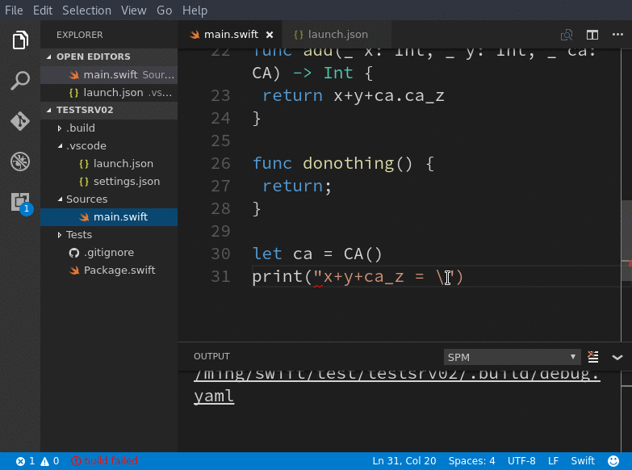

+++
title = "Get Started with Swift Development Environment"
date = 2017-01-11
[taxonomies]
categories = ["2017"]
tags = ["swift", "sde", "demo"]
+++

A hands-on introduction for [SDE](https://github.com/jinmingjian/sde) 1.0 release.

# Quick Preview

# Explanation

1. You can start coding with the __empty folder__.

2. First, as I mentioned in the project, the current design and implementations are __convention-based__. Basically we follow the SPM convention. So, you should set up conventions early and as possible to help tools to understand all you want.

3. write your __Pacakge.swift__ to config the whole project, like dependencies and layouts if have.

4. Start main.swift or some other sources(main.swift is the convention for the executable product).
When tpying with '.', ':', '(', you'll get __code suggestions__. Because it is found in many other cases the sourcekit like to give useless suggestion or nothing. But you can trigger suggestion by shortcut anytime, like "do" for "donothing()" shown in the preview.

5. Not only the single source file, SDE supports to provide helps in the __project-wide sources__, like click a symbol to go to its declartion in another file.

6. To make editor to __show diagnostics__ for your sources, you need to build the project. This may be slow when first time. I guess you are still OK, because you skip the boring configure time like done in IDEA or Eclipse for JAVA or others:) 

7. SDE will give you an __indicator for building__ in the left of status bar. You can watch the stdout of building in the output console named "SPM"(or tell me if you have a better name for this console?). If the building failed, you got an red indicator.

8. By default, it will fire a __build when every save__. Because "save", as a convention, can help SPM and then tools understand the latest of your project. This is commonly quick and done in background process. But you can disable this behavior. And SDE also provides a shortcut 'Alt+B' for trigging a build by manual.

9. Also note, you can __format__ the whole document or selection:)

10. __Debugging__ is done as your expection. However, but SDE only support the variables and call stack view. Soon, I will add the expression evaluation. Sometimes, you may meet "can not read ...." when Debugging. This may be the bug of lldb at linux. I continue to investigate this problem and its solution to help your futher.

There is a [example demo project](https://github.com/jinmingjian/sde-demos) if you just want to do a quick experiment.

(NOTE: sorry, the development of SDE project has been discontinued because the author can not foresee a well formed ecosystem in the Swift backend side. But all sources are there for who's interests.)

 

